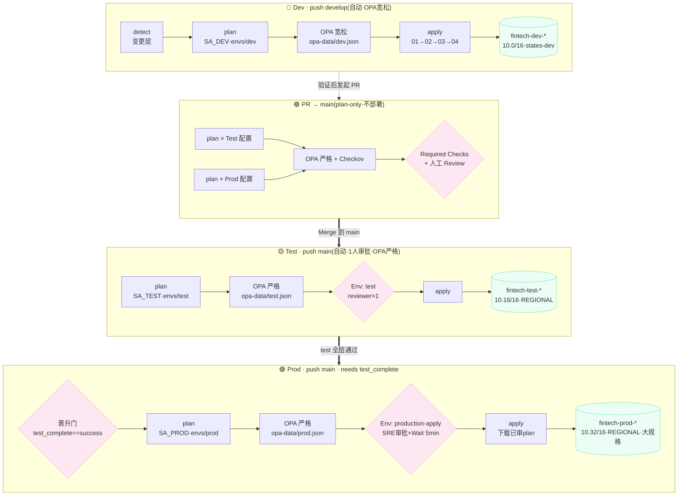

# fintech-sre-rehearsal — IaC 仓库(模块化 + 三环境版)

## 架构
GitHub + GCP + GitHub Actions + 4 层解耦 + **三环境(dev / test / prod)晋升**,
三层核心资源改用**官方模块**。同一套层代码,靠 `envs/<env>/` 注入差异。

## 目录结构
```
.
├── .github/workflows/
│   ├── gcp-fintech-iac.yml     # 主流水线:develop→Dev, main→Test→Prod 晋升链
│   ├── _layer.yml              # 子流水线:auth→init→plan→OPA(环境感知)→(push)apply
│   └── gcp-fintech-destroy.yml # 手动分层 destroy(env + layer + 确认词)
├── policies/                   # OPA rego 规则(gcp_sql / gcp_gke / lib)
├── opa-data/                   # 环境合规级别数据(dev 宽松 / test·prod 严格)
├── envs/                       # 各环境差异:tfvars(参数) + backend.hcl(state 桶)
│   ├── dev/    01~04-*.tfvars / *.backend.hcl
│   ├── test/   ...
│   └── prod/   ...
├── 01-network/                 # 官方 network 模块:VPC+子网+PSA+NAT(参数化)
├── 02-core-db/                 # 官方 sql-db/postgresql 模块:合规 Cloud SQL
├── 03-gke-platform/            # 官方 kubernetes-engine/private-cluster 模块
├── 04-apps/                    # 应用层(待补)
├── docs/SETUP-3ENV.md          # ★ 三环境落地手册(GCP + GitHub 配置清单)
└── _opa-test/                  # OPA 自测样本
```

## 流程图(分支 → 环境 晋升链)



**四道安全防线**:① paths-filter 只跑变更层 → ② OPA `deny` 硬红线(环境感知,`deny`→exit1 阻断) → ③ Checkov 软扫描 → ④ Environment 人工审批。
同一个 commit 依次经过 Test→Prod,保证"测的就是要部署的"。

## 三环境模型
| | dev | test | prod |
|--|-----|------|------|
| 触发 | push `develop`(自动) | push `main`(自动) | push `main`(test 后,人工审批) |
| 命名前缀 | `fintech-dev-*` | `fintech-test-*` | `fintech-prod-*` |
| CIDR 段 | 10.0/16 段 | 10.16/16 段 | 10.32/16 段 |
| State 桶 | states-dev | states-test | states-prod |
| Service Account | sa-fintech-dev | sa-fintech-test | sa-fintech-prod |
| GitHub Env | `dev` | `test` | `production-apply` |
| OPA | 宽松(可 ZONAL) | 严格 | 严格 |

> 当前三环境共用同一 GCP 项目,靠命名/CIDR/桶/SA 模拟隔离。
> 未来拆多项目:只改 `envs/<env>/*.tfvars` 的 `project_id`,代码零改动。

## 参数化机制
- 层代码**只写一份**,不含任何环境专属值(project/region/CIDR/名称全部走变量)。
- `terraform init -backend-config=envs/<env>/<layer>.backend.hcl` → 注入独立 state。
- `terraform plan -var-file=envs/<env>/<layer>.tfvars` → 注入环境参数。
- `conftest ... -d opa-data/<env>.json` → 注入环境合规级别(policy-as-data,安全默认强制)。

## 使用的官方模块(已锁版本)
| 层 | 模块 | 版本约束 |
|----|------|---------|
| 01 | terraform-google-modules/network/google | ~> 18.1 |
| 01 | terraform-google-modules/cloud-router/google | ~> 6.0 |
| 02 | terraform-google-modules/sql-db/google//modules/postgresql | ~> 28.1 |
| 03 | terraform-google-modules/kubernetes-engine/google//modules/private-cluster | ~> 37.0 |

## 层间依赖
02/03 通过 `terraform_remote_state` 读 01 的 outputs(桶由 `state_bucket` 变量按环境指定)。
每个环境内部必须按 01 → 02 → 03 → 04 顺序 apply(流水线用 `needs` 强制)。

## 前置
```bash
gcloud services enable compute.googleapis.com container.googleapis.com \
  sqladmin.googleapis.com servicenetworking.googleapis.com
```
**首次落地请按 [docs/SETUP-3ENV.md](docs/SETUP-3ENV.md) 创建:**
3 个 state 桶、3 个 SA、WIF 绑定、6 个 GitHub Variables、3 个 Environment、分支保护。

## 模块化说明
- 层目录 = 部署单元(root module),backend 留空由 CI 注入 → 一份代码对接三套 state。
- 层内不手写 compute_*/sql_* 资源,改为调用官方模块。
- 新增环境(如 staging):复制 `envs/dev/` 为 `envs/staging/`、改值 + 建对应桶/SA/Environment 即可。
